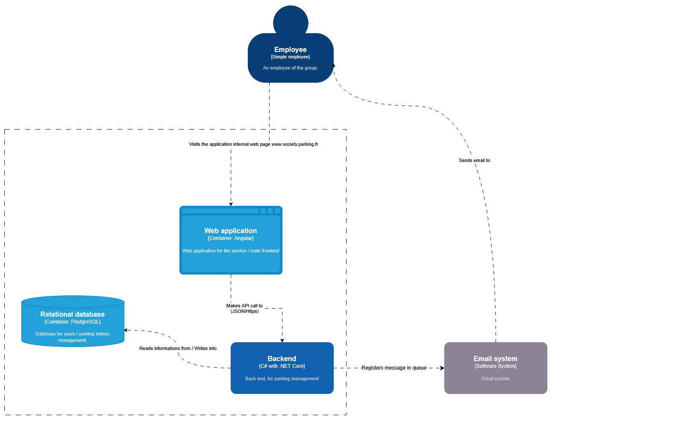
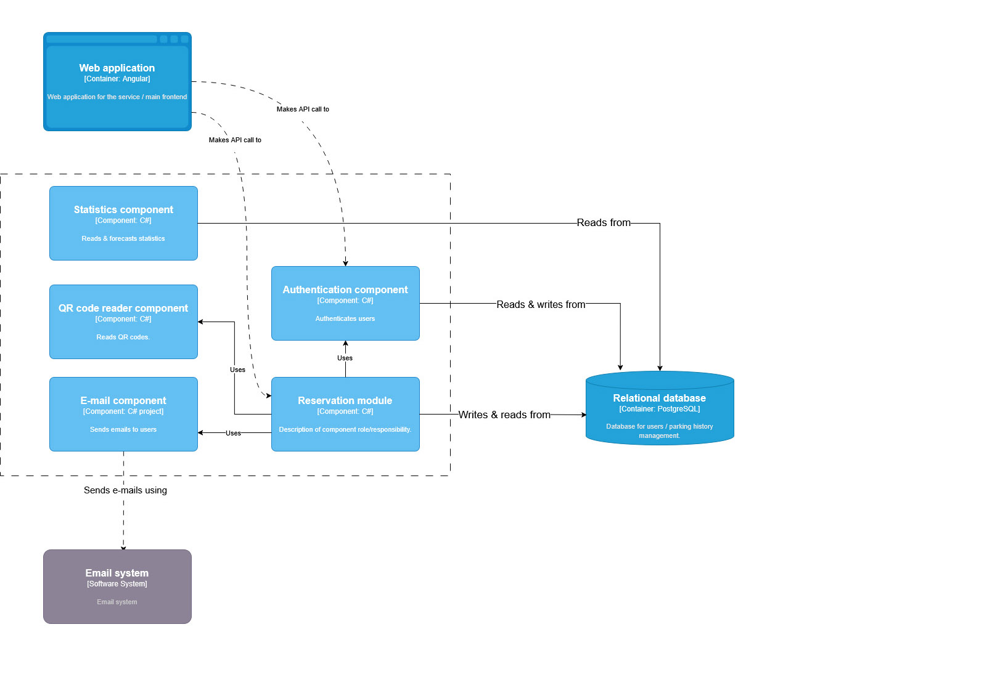

# software-engineering-heuristiques-compromis

## C4 Diagrams

### Containers Diagram

### Context Diagram

### Component Diagram

# ADR
### ADR-001 - Choix du Techno Backend : C# .NET

Status  
Accepté

Context  
Nous devons choisir une technologie backend pour notre projet "Parking Reservation System". Le projet doit être réalisé en une semaine. L’équipe a une connaissance partielle de Spring Boot, mais certains membres maîtrisent mieux C# .NET.

Decision  
Nous choisissons C# .NET comme technologie backend pour le projet.

Raisons
- Un ou plusieurs membres ont des compétences en C# .NET
- .NET est rapide à prendre en main pour des projets simples
- .NET permet de créer une API REST facilement

Conséquences
- Moins de temps de formation nécessaire
- Développement rapide avec les outils Visual Studio
- Backend compatible avec PostgreSQL via les connecteurs .NET

###  ADR-002 - Choix du Framework Frontend : Angular vs React

Status  
Accepté

Context  
Nous devons choisir un framework frontend pour notre projet "Parking Reservation System". L'équipe a peu de temps pour monter en compétences.

Decision  
Nous choisissons Angular comme framework frontend.

Raisons
- Framework complet et structuré avec les Guards, Services, etc.
- Intégration de la sécurité: La gestion des rôles et des accès (RBAC) est simplifiée dans Angular avec des guards et des interceptors HTTP.
- Moins structuré : React est une librairie UI, il aurait fallu ajouter et configurer manuellement des briques complémentaires (routing, gestion des formulaires, gestion des états, etc.).
- Un membre maîtrise Angular, les autres non
- Le temps limité ne permet pas d’apprendre React

Conséquences
- Angular facilitera le développement rapide
- Un membre pourra guider l’équipe
- Courbe d’apprentissage plus courte que React dans notre contexte

---

###  ADR-003 - Choix de la base de données : PostgreSQL vs Oracle

Status  
Accepté

Context  
Nous devons choisir une base de données pour gérer les réservations, utilisateurs, et historiques.

Decision  
Nous choisissons PostgreSQL comme base de données.

Raisons
- Gratuit et open source, contrairement à Oracle
- Compatible avec Spring Boot
- Facile à utiliser avec Docker
- L’équipe connaît déjà PostgreSQL

Conséquences
- Déploiement rapide avec Docker
- Pas de coût supplémentaire
- Moins de temps d’apprentissage pour l’équipe

---

###  ADR-004 - Choix d’utiliser Docker vs kubernetes

Status  
Accepté

Context  
Nous avons besoin d’un environnement facile à installer et identique pour toute l’équipe.

Decision  
Nous choisissons d’utiliser Docker pour exécuter PostgreSQL et le backend Spring Boot.

Raisons
- Docker permet d’isoler chaque service dans un conteneur dédié
- Permet de lancer plusieurs services (PostgreSQL, backend, frontend en angular pour notre projet) avec un seul `docker-compose up`
- Docker est compatible avec les environnements Windows, Linux et Mac ce qui est  idéal pour le temps limité de notre projet.
- Facilite le déploiement en créant des images prêtes à l’emploi
- Kubernetes est surdimensionné pour ce projet : complexité, fichiers de configuration, gestion des clusters
- Réduit les problèmes de compatibilité (versions de .NET, PostgreSQL, etc.)

Conséquences
- Chaque membre doit installer Docker
- Le projet est facilement portable
- Gain de temps pour l’installation et la configuration

---

###  ADR-005 - Choix Monolith vs Microservices

Status  
Accepté

Context  
Nous devons choisir une architecture backend. Le projet doit être terminé en une semaine et reste simple.

Decision  
Nous choisissons une architecture Monolithique pour le projet.

Raisons
- Pas besoin de gérer la communication inter-services (API REST, files de messages, etc.)
- Plus simple et rapide à développer
- Moins de configuration et de complexité
- le Monolithe: Un seul point d’entrée simplifie l’authentification et la gestion des sessions
- Moins de surcharge technique (pas besoin de gérer des bases de données séparées, des latences réseau, des erreurs de timeout)

Conséquences
- Moins d’évolutivité que des microservices
- Moins de flexibilité pour découper le projet plus tard
- Mais plus adapté au temps et à l’objectif du projet

